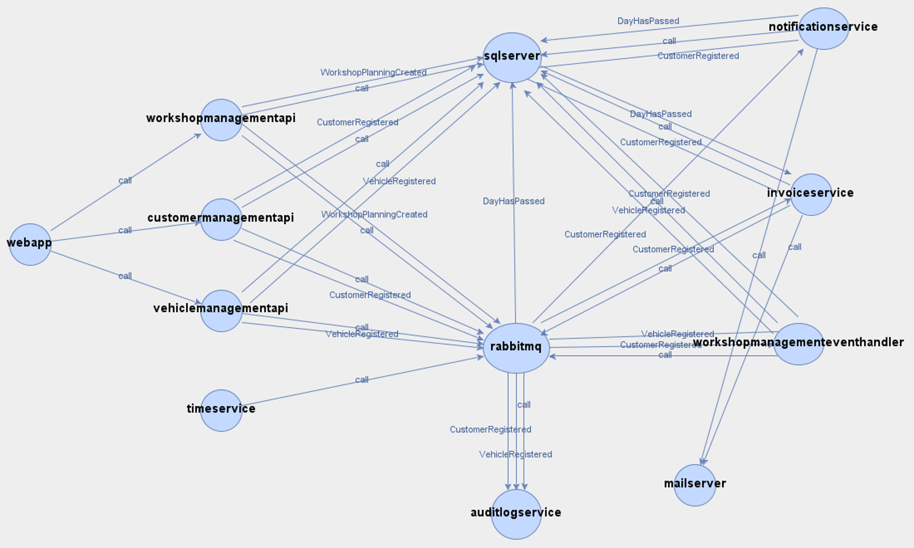

# Microservice Dependency Graph

Microservice architecture enables scalable and extensible systems by breaking down functionality into small, independent components. However, as these systems evolve, ensuring compliance with policies and design constraints becomes challenging. To address this, a technique for constructing a Microservices Dependency Graph (MDG). This graph models call and data dependencies between microservices, service buses, publish-subscribe frameworks, and databases.

The MDG is built using log analysis and probabilistic reasoning to associate logged events. It is a labeled, typed, directed multigraph where:

* Nodes represent microservices, service buses, and databases.

* Edges represent data exchanges and request interactions.

Currently the framework is only configured to work the "Pitstop - Garage Mangagement System" (https://github.com/EdwinVW/pitstop)application. Additional work needs to be done to handle different microservice and database logging standards.

## Project Structure
    ./
        │
        ├──Container_Data/                 # Contains docker container specific data 
        │   │
        │   ├── ContainerData.txt          # Obtained from Docker environment
        │   └── dockerData.txt             # Obtained from Docker environment
        │
        ├──Graph_Analysis/                 # Contains Multigraph 
        │   │
        │   ├── DependencyMultiGraph.gml   # Dependency MultiGraph
        │   └── MultiGraph.png             # Visual Representation of Multigraph for Pitstop
        │ 
        ├──Logs/                           # Logs from the base application
        │   │
        │   ├── Corpus.clef                # Microservice logs
        │   ├── Invoice.log                # Database logs
        │   ├── Notification.log           # Database logs
        │   ├── Vehicle.log                # Database logs
        │   ├── Workshop.log               # Database logs
        │   └──  Workshopevent.log         # Database logs
        │
        ├──Microservice Dependency Graph/ # Novel Microservice Dependency Graphing Framework
        │   │
        │   ├── lib/                       # Shared models, externals, and utilities
        │   │   ├── models.py              # Data models (e.g., containerData)
        │   │   ├── externals.py           # External Libraries (e.g., Networkx)
        │   │   └── utilities/             # Helper functions
        │   │       └──  helpers.py        # Helper functions (e.g., getBodyData)
        │   │
        │   ├── pipeline/                  # Pipeline modules
        │   │   ├── container_discovery/   # Container discovery stage
        │   │   ├── event_extraction/      # Event extraction stage
        │   │   ├── event_correlation/     # Event correlation stage
        │   │   ├── knowledge_processing/  # Knowledge processing stage
        │   │   └── graph_construction/    # Graph construction stage
        │   │
        │   └── main.py                    # Main entry point for the pipeline
        │
        ├── LICENSE                        # Configuration settings
        ├── requirements.txt               # Required Libraries
        ├── README.md                      # Project documentation
        └── Thesis_AndresR.pdf/            # Published thesis

## Getting Started

### Prerequisites

* Python 3.10 or higher
* Docker
* Required Python Libraries (install via requirements.txt)


### Steps
1. Clone the repository:

```
git clone https://github.com/Andres-Osamu/Microservice_Dependency_Graph.git
cd microservice_Dependency_Graph
```

2. Install the required dependencies:
```
pip install -r requirements.txt
```
3. Ensure Docker is running on your system
* [Currently the framework is only configured to work with Pitstop](https://github.com/EdwinVW/pitstop)

### Usage
1. Run the pipline
```
python main.py
```

2. The pipeline wil
    * Fetch container Data
    * Extract and process events
    * Correlate events and extract domain knowledge
    * Generate and export dependency graphs

3. Output files:
    * DependencyMultiGraph.gml 

## Research Publications & Presentations

**Publications**
1. Western University Thesis and Dissertation
    * **Title**: ”Extracting Microservice Dependencies Using Log Analysis”
    * **Year**:  2022
    * **Link**:  [Thesis](https://ir.lib.uwo.ca/etd/8886/)

2. IEEE 29th Annual Software Technology COnference (STC)
    * **Title**: ”Extracting Microservice Dependencies Using Log Analysis”
    * **Year**:  2022
    * **Link**:  [Paper](https://ieeexplore.ieee.org/document/9951030)


**Presentations**
* IEEE Software Technology Conference - 2022
* WeaveSphere - CASCON X EVOKE 2022
* CASCON X TechXchange 2023

## Visualization

**Dependency Graph**
Below is an example of a dependency graph generated by the framework for the Pitstop application:



## Contributing

I welcome contributions to this project! If you'd like to contribute, please follow these steps:
Fork the repository.

1. Create a new branch for your feature or bugfix.

2. Commit your changes and push to your fork.

3. Submit a pull request with a detailed description of your changes.


## License

This project is licensed under the GNU General Public License - see the [LICENSE.md](LICENSE.md) file for details

## Acknowledgments

* **Christ Brealey** of IBM Toronto Lab for their invaluable comments and technical discussions.
* **Dr. Kostas Kontogiannis** of Western Univeristy for your invaluable guidance, constant support and endless generosity throughout the completion of this thesis.